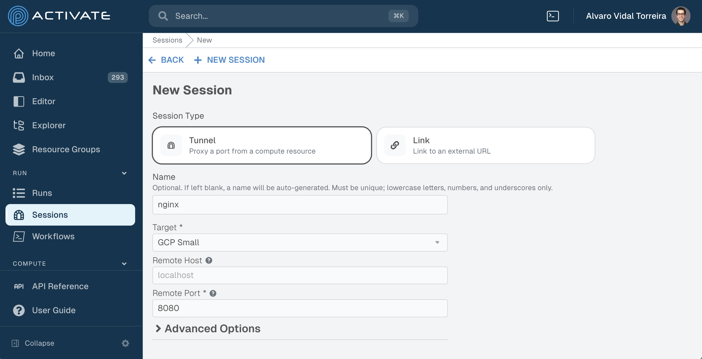

# Running Nginx on Activate — A Workflow Tutorial

This tutorial shows how to run a containerized Nginx server on an Activate cloud cluster and expose it via a browser session. It starts with manual steps so you can see exactly what is happening, then automates each piece progressively using Activate workflows.

By the end you will understand how to:

- Define workflow inputs and run steps on a remote cluster over SSH
- Use `needs` to sequence jobs and pass data between them via outputs
- Create browser sessions (tunnels) automatically from a workflow
- Use `pw agent` to find a free port at runtime

---

## Prerequisites

- An Activate cluster with Docker available on the controller node (root access required)
- Basic familiarity with YAML

---

## Stage 1 — Manual setup

SSH into your cluster's controller node, then start Docker and run Nginx:

```bash
sudo systemctl start docker
echo "Hello World" > index.html
sudo docker run -d \
  -p 8080:80 \
  --name nginx-hello \
  -v index.html:/usr/share/nginx/html/index.html \
  nginx
```

Verify the container is up and check the logs:

```bash
sudo docker ps
sudo docker logs -f nginx-hello
```

### Create a session manually

A **session** is a browser-accessible tunnel from the Activate platform to a port on your cluster. Go to **Sessions → New Session** in the Activate UI:



Fill in:

| Field | Value |
|---|---|
| Session Type | Tunnel |
| Name | nginx |
| Target | your cluster resource |
| Remote Port | 8080 |

Click **NEW SESSION**, then click the session link to open Nginx in your browser.

### Cleanup

```bash
sudo docker stop nginx-hello
sudo docker rm nginx-hello
```

If you click the session link after cleanup, you will see an error — there is no longer a service running on that port.

---

## Stage 2 — Automate with a workflow

Instead of SSHing manually, a workflow can do all of this for you. The following workflow starts Nginx and streams its logs, cleaning up automatically when the workflow is stopped.

```yaml
jobs:
  start_nginx:
    ssh:                                    # Run all steps in this job over SSH
      remoteHost: ${{ inputs.resource.ip }} # Expression: resolved at runtime from the resource input
    steps:                                  # Steps run sequentially within a job
      - name: Start docker
        run: sudo systemctl start docker
      - name: Write index.html
        run: echo "${{ inputs.msg }} from ${PW_JOB_ID}" > index.html
      - name: Start Nginx
        run: |
          sudo docker run -d \
            -p 8080:80 \
            --name nginx-hello \
            -v $(pwd)/index.html:/usr/share/nginx/html/index.html \
            nginx

  stream_logs:                              # Jobs run in parallel by default...
    needs:                                  # ...unless you declare dependencies with needs
      - start_nginx
    if: ${{ always }}                       # Run this job even if start_nginx fails
    ssh:
      remoteHost: ${{ inputs.resource.ip }}
    steps:
      - name: Stream Logs
        run: sudo docker logs -f nginx-hello
        cleanup: |                          # cleanup always runs when a step ends or the workflow is canceled
          sudo docker stop nginx-hello
          sudo docker rm nginx-hello

on:
  execute:
    inputs:
      resource:
        label: Resource Target
        type: compute-clusters              # Renders a cluster picker in the run form
        autoselect: true
        optional: false
      msg:
        label: Message
        type: string
```

### Concepts introduced

**Jobs run in parallel, steps run sequentially.**
Every job in a workflow starts at the same time unless you declare dependencies. Within a job, steps run one after another. Here `stream_logs` must wait for `start_nginx` because it is listed under `needs`.

**`ssh` at the job level.**
Setting `ssh.remoteHost` on a job runs every step in that job on the remote cluster over SSH. You can also set it per step if different steps target different hosts.

**Expressions `${{ }}`.**
Expressions are evaluated at runtime and replaced with their values. `${{ inputs.resource.ip }}` resolves to the IP of whichever cluster you pick when you run the workflow. `${PW_JOB_ID}` is a plain shell environment variable.

**`if: ${{ always }}`.**
By default a job is skipped if one of its `needs` fails. `always` overrides that, which is what you want for `stream_logs` since you want cleanup to happen even when `start_nginx` errors.

**`cleanup`.**
Commands listed under `cleanup` run after the step finishes — whether it succeeds, fails, or the workflow is manually canceled. If multiple steps define a `cleanup`, they run in reverse order relative to the steps. It is the right place for teardown logic.

**`on.execute.inputs`.**
This section defines the form users fill in before running the workflow. The `compute-clusters` type renders a cluster picker; `string` renders a text field. Input values are then available anywhere in the workflow as `${{ inputs.<name> }}`.

Run this from **Workflows** in the Activate UI, pick your cluster, enter a message, and click **Execute**. Once the workflow is running, navigate to the session you created in Stage 1 and Nginx will be serving again.

---

## Stage 3 — Add automated session creation

The next step is to let the workflow create the session itself. This requires two additions: a `sessions` block that declares the session, and a new job that calls the `parallelworks/update-session` action.

```yaml
sessions:
  nginx:                                    # Declare a named session for this workflow
    useTLS: false

jobs:
  start_nginx:
    # ... same as above ...

  stream_logs:
    # ... same as above ...

  session:
    needs:
      - start_nginx                         # Wait until Nginx is running before creating the tunnel
    steps:
      - name: Create Session
        uses: parallelworks/update-session  # Built-in action that wires up a session tunnel
        with:
          remotePort: '8080'
          target: ${{ inputs.resource.id }} # The cluster's resource ID (not its IP)
          name: ${{ sessions.nginx }}       # Reference to the session declared above

on:
  execute:
    inputs:
      resource:
        label: Resource Target
        type: compute-clusters
        autoselect: true
        optional: false
      msg:
        label: Message
        type: string
```

### Concepts introduced

**`sessions` block.**
Declaring a session at the top of the workflow registers it with the platform. You can reference it later using `${{ sessions.<name> }}`, which resolves to a unique session identifier for this run.

**`parallelworks/update-session`.**
This is a built-in action (`uses:`) that creates or updates a tunnel session. For a tunnel session the required fields are `name`, `target` (the resource ID), and `remotePort` (the port on the remote cluster). You do not need an `ssh` block — this action runs on the Activate platform, not on the cluster.

**`inputs.resource.id` vs `inputs.resource.ip`.**
A `compute-clusters` input exposes multiple properties. Use `.ip` when you need to SSH into the cluster; use `.id` when referring to the resource in platform API calls like `update-session`.

Now when you run the workflow the session is created automatically. Click the session link in the **Sessions** panel to open Nginx.

---

## Stage 4 — Dynamic port with `pw agent`

Hardcoding port `8080` works, but it means you can only run one instance of this workflow at a time — a second run would collide on the same port. The final version asks the platform for a free port at runtime.

```yaml
permissions:
  - '*'                                     # Required to authenticate the pw client inside the workflow

sessions:
  nginx:
    useTLS: false

jobs:
  start_nginx:
    ssh:
      remoteHost: ${{ inputs.resource.ip }}
    steps:
      - name: Start docker
        run: sudo systemctl start docker
      - name: Write index.html
        run: echo "${{ inputs.msg }} from ${PW_JOB_ID}" > index.html
      - name: Choose Remote Port
        run: |
          PORT=$(pw agent open-port)                  # Ask the pw agent for an available port
          echo "PORT=${PORT}" | tee -a $OUTPUTS       # Publish it so downstream jobs can read it
      - name: Start Nginx
        run: |
          sudo docker run -d \
            -p ${{ needs.start_nginx.outputs.PORT }}:80 \
            --name nginx-hello-${{ needs.start_nginx.outputs.PORT }} \
            -v $(pwd)/index.html:/usr/share/nginx/html/index.html \
            nginx

  stream_logs:
    if: ${{ always }}
    needs:
      - start_nginx
    ssh:
      remoteHost: ${{ inputs.resource.ip }}
    steps:
      - name: Stream Logs
        run: sudo docker logs -f nginx-hello-${{ needs.start_nginx.outputs.PORT }}
        cleanup: |
          sudo docker stop nginx-hello-${{ needs.start_nginx.outputs.PORT }}
          sudo docker rm nginx-hello-${{ needs.start_nginx.outputs.PORT }}

  session:
    needs:
      - start_nginx
    steps:
      - name: Create Session
        uses: parallelworks/update-session
        with:
          remotePort: ${{ needs.start_nginx.outputs.PORT }}
          target: ${{ inputs.resource.id }}
          name: ${{ sessions.nginx }}

on:
  execute:
    inputs:
      resource:
        label: Resource Target
        type: compute-clusters
        autoselect: true
        optional: false
      msg:
        label: Message
        type: string
```

### Concepts introduced

**`pw agent open-port`.**
The `pw` CLI is available inside every workflow step. `pw agent open-port` queries the platform for a port that is free on the cluster and returns it as a number. Because this runs as a shell command, the result is captured into the `PORT` shell variable.

**`$OUTPUTS`.**
`$OUTPUTS` is an environment variable injected by the platform that points to a file. Writing `KEY=VALUE` lines to it publishes those values as job outputs. Any job that lists this job under `needs` can then read them as `${{ needs.<job-name>.outputs.KEY }}`.

**`needs.<job>.outputs.<name>`.**
This expression reads a value published by an upstream job. Here `needs.start_nginx.outputs.PORT` is used in three places: the `docker run` command, the `stream_logs` cleanup, and the `update-session` call — all referencing the same port that was chosen in the `start_nginx` job.

**`permissions: ['*']`.**
The `pw` CLI authenticates against the Activate API. The `permissions` field grants the workflow a token with the same access as the user who runs it. Without this, `pw agent open-port` will fail.

**Why include the port in the container name.**
`--name nginx-hello-$PORT` means two simultaneous runs of this workflow produce containers with different names. Without this they would conflict and the second `docker run` would fail.

---

## Summary

| Stage | What changes | Key concept |
|---|---|---|
| 1 | Manual: SSH + docker + session UI | Understanding the target |
| 2 | Workflow starts Nginx, streams logs, cleans up | Jobs, steps, ssh, needs, cleanup, inputs |
| 3 | Workflow also creates the session | sessions block, update-session action |
| 4 | Port chosen dynamically at runtime | pw agent, $OUTPUTS, inter-job outputs, permissions |

The final `workflow.yaml` in this repository is the Stage 4 version.
